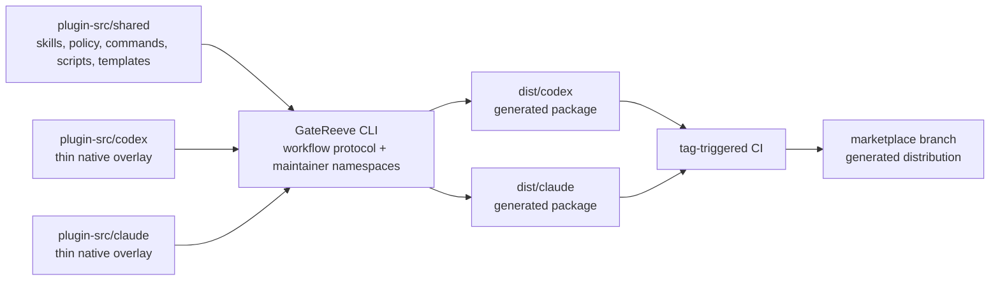

# Developing the Agentic Development Workflow

This is the end-to-end guide for maintainers who change the workflow plugin
itself. It begins with one safe change and then explains the repository,
maintainer CLI, validation layers, and common maintenance paths in more depth.

Plugin users do not need this checkout, npm, Docker, or the optional CLI. The
plugin itself now requires Node 22.12 or newer for its packaged protocol core.
They should follow [`INSTALL.md`](INSTALL.md), then
[`USER-GUIDE.md`](USER-GUIDE.md). When a verified change is ready to publish,
switch to [`RELEASING.md`](RELEASING.md).

## The Development Model

The repository has one canonical source tree and two generated native packages:



The practical rule is simple:

> Edit `plugin-src/`, `cli/`, documentation, or site source. Never edit
> `dist/`, an installed plugin cache, or the `marketplace` branch as source.

`dist/` is ignored and may be deleted at any time. The `marketplace` branch is
replaced atomically by release automation and is not a development branch.

## First Safe Change

This path takes a fresh maintainer checkout through one representative shared
workflow change and stops when the branch is ready for a pull request.

### 1. Install the maintainer prerequisites

The supported development environments are macOS and Ubuntu 22.04 or 24.04.
Use Ubuntu under WSL when developing from Windows.

Required:

- Git;
- GitHub CLI, authenticated for this repository;
- Node.js 22.12 or newer (CI currently uses Node 24 LTS);
- npm;
- Python 3.10 or newer; and
- Codex and Claude Code only when running native-manager smoke tests.

Docker is optional for ordinary edits and required for reproducing both Ubuntu
acceptance images locally.

Verify the tools already installed on the machine:

```bash
git --version
gh --version
gh auth status
node --version
npm --version
python3 -c 'import sys; assert sys.version_info >= (3, 10), sys.version'
```

On macOS, Homebrew can provide the shared command-line tools. Install Node 24
with the Node version manager already used on the machine.

```bash
brew update
brew install git gh python
```

On Ubuntu, install the shared operating-system packages, then install Node 24
with the machine's normal Node version manager or approved package source.

```bash
sudo apt update
sudo apt install -y git gh python3 ca-certificates
```

Do not continue until `node --version` reports 22.12 or newer. The plugin and
optional CLI share this runtime requirement.

### 2. Clone and bootstrap the checkout

```bash
gh repo clone TrentBrown/agentic-development-workflow
cd agentic-development-workflow
npm ci --prefix cli
npm start --prefix cli -- help --recurse
```

The last command prints the complete recursive CommanderJS command tree. This
guide uses the portable `npm start --prefix cli -- ...` form. A local or global
installation exposes the same entrypoint as `gatereeve`.

The CLI uses its direct pinned Commander dependency and repository-local help
renderer. Installation therefore has no exact non-LTS engine dependency or
expected `EBADENGINE` advisory.

### 3. Start the change with the workflow itself

Develop the workflow by using the workflow. Begin in a fresh Codex or Claude
Code session with the installed plugin enabled, and ask the agent to use the
software-development workflow for the proposed change. Non-trivial work should
produce a topic branch and cumulative `docs/issues/<featureId>/` lifecycle
folder before implementation. A configured feature keeps that folder while
later sequential PRs use fresh delivery branches; legacy unconfigured work
continues to use the current branch as its feature ID.

The normal sequence is:

1. design interview and `interview.md`;
2. approved `design.md`;
3. acceptance criteria and rubric in `spec.md`;
4. validated plan, issue breakdown, and tracker;
5. implementation with decision logging; and
6. PR-boundary evaluation, judge, review, explanation, and triage.

The canonical process is
[`plugin-src/shared/resources/policy/WORKFLOW.md`](plugin-src/shared/resources/policy/WORKFLOW.md).
The branch prefix comes from `agentic-workflow.branchPrefix`; do not copy
another maintainer's prefix.

### 4. Change canonical source

For a representative shared workflow behavior change, edit the appropriate
files under `plugin-src/shared/`:

- `skills/<skill>/SKILL.md` routes an agent into the capability;
- `resources/commands/<command>.md` contains command-level procedure;
- `resources/policy/` contains cross-command policy and standards;
- `resources/scripts/` contains deterministic mechanics; and
- `resources/templates/` contains branch and smoke-test templates.

Keep skill entrypoints compact. Put shared policy in policy files, procedural
detail in command resources, and deterministic work in scripts rather than
duplicating large instructions across skills.

For example, a change to the PR-boundary sequence starts by reading the thin
skill entrypoint and its owned procedure:

```bash
sed -n '1,220p' \
  plugin-src/shared/skills/workflow-pr-boundary/SKILL.md
sed -n '1,280p' \
  plugin-src/shared/resources/commands/pr-boundary.md
```

If the new behavior belongs only to that operation, change the command
resource and keep the skill as a stable router. If it changes a workflow-wide
invariant, amend `resources/policy/WORKFLOW.md` as well and check every command
that consumes the invariant. This is the representative “one safe change” used
by the rest of the tutorial: canonical shared prose first, contract checks
second, generated packages last.

When adding, removing, or renaming distributable files, update
[`plugin-src/contracts/workflow-inventory.json`](plugin-src/contracts/workflow-inventory.json).
When native manifests, catalogs, hooks, or supported client behavior changes,
update
[`plugin-src/contracts/platform-contracts.json`](plugin-src/contracts/platform-contracts.json)
and its tests.

### 5. Run focused source checks

These checks are fast and should run while the change is still small:

```bash
npm start --prefix cli -- plugin validate
npm start --prefix cli -- plugin lint
npm start --prefix cli -- plugin validate-native
npm test --prefix cli
```

- `validate` checks the declared skill and resource inventory.
- `lint` rejects non-portable paths, inventory drift, symlinks, and other
  package-source hazards.
- `validate-native` checks both platform manifests, catalogs, and activation
  hooks against their contracts.
- `npm test` covers the CLI, composition, publication, setup/doctor, and
  documentation contracts.

Add focused Node or Python tests whenever behavior changes. Python helpers have
tests beneath `plugin-src/shared/resources/scripts/tests/` and the pattern
system has its own tests under `resources/scripts/pattern/tests/`.

### 6. Build and inspect both native packages

```bash
npm start --prefix cli -- plugin clean
npm start --prefix cli -- plugin build \
  --source-commit "$(git rev-parse HEAD)"
```

Inspect generated identity and provenance rather than editing the output:

```bash
python3 -m json.tool dist/codex/.codex-plugin/plugin.json
python3 -m json.tool dist/claude/.claude-plugin/plugin.json
python3 -m json.tool dist/codex/.workflow-build/provenance.json
cmp \
  dist/codex/.workflow-build/shared-files.json \
  dist/claude/.workflow-build/shared-files.json
```

The shared-file inventories must match exactly. Platform overlays may add only
their native manifest and hook differences; the composer rejects collisions
with shared paths.

### 7. Run broad acceptance

The portable acceptance script is the normal pre-PR broad check:

```bash
bash ci/portable-acceptance.sh
```

It runs the Node and Python suites, npm audit, contracts, portability and native
validation, deterministic dual-package composition, setup, doctor, and selected
workflow document gates.

To reproduce both hosted Ubuntu container jobs locally:

```bash
docker build \
  --file Dockerfile.acceptance \
  --build-arg UBUNTU_VERSION=22.04 \
  --tag workflow-acceptance:22.04 \
  .
docker run --rm workflow-acceptance:22.04

docker build \
  --file Dockerfile.acceptance \
  --build-arg UBUNTU_VERSION=24.04 \
  --tag workflow-acceptance:24.04 \
  .
docker run --rm workflow-acceptance:24.04
```

Pull requests and pushes to `main` run the same Ubuntu 22.04/24.04 native and
container matrix in [`.github/workflows/plugin-ci.yml`](.github/workflows/plugin-ci.yml).

### 8. Exercise the native plugin managers when needed

When a change affects packaging, manifests, catalogs, hooks, setup, doctor, or
skill discovery, run the disposable native-manager smoke test:

```bash
npm start --prefix cli -- plugin smoke-install --keep
```

The command builds both packages, creates a local marketplace, installs each
package into an isolated Codex or Claude configuration directory, verifies the
skill inventory, and runs setup plus doctor. It does not overwrite the
maintainer's normal agent profiles.

The structural activation flag proves the expected hook contract. It does not
prove that a fresh authenticated agent session invoked the workflow
spontaneously. Use
[`docs/PLUGIN-SMOKE-TEST.md`](docs/PLUGIN-SMOKE-TEST.md) for that behavioral
acceptance step.

### 9. Prepare the pull request boundary

Ask the agent to run `workflow-pr-boundary`. A complete boundary reconciles
`issues.md` and `tracker.md`, records the exact verification matrix, evaluates
the spec, runs the adversarial judge and code review, creates
`explain-diff.html`, triages decisions, and updates the PR description.

Before committing, confirm that only intended sources and branch artifacts are
present:

```bash
git status --short --branch
git diff --check
git diff --stat main...HEAD
```

Do not commit `dist/`, checkpoints, handoffs, agent caches, or installed plugin
files. The branch is ready for human review only when all in-scope gates pass or
the maintainer explicitly accepts a recorded exception.

## Repository Reference

### Top-level map

| Path | Role | Source status |
|------|------|---------------|
| `plugin-src/shared/` | Cross-platform skills, policy, commands, scripts, and templates | Canonical |
| `plugin-src/codex/` | Codex manifest and hook overlay | Canonical |
| `plugin-src/claude/` | Claude Code manifest and hook overlay | Canonical |
| `plugin-src/catalogs/` | Native marketplace catalogs | Canonical |
| `plugin-src/contracts/` | Machine-readable inventory and platform contracts | Canonical |
| `cli/` | Optional CommanderJS protocol CLI, maintainer namespaces, and tests | Canonical |
| `ci/` and `.github/workflows/` | Acceptance and atomic publication automation | Canonical |
| `docs/` | Branch lifecycle artifacts, release evidence, and supporting design records | Canonical records |
| `workflow-site/` | Static explanatory mini-site, independent of the distributable plugin | Canonical presentation source plus rendered assets |
| `dist/` | Locally composed Codex and Claude packages | Generated and ignored |
| `marketplace` branch | Published catalogs, packages, and `RELEASE.json` | Generated distribution |

### Choose the right source for a change

| Change | Primary source | Common companion updates |
|--------|----------------|--------------------------|
| Workflow-wide rule | `shared/resources/policy/` | Entry skill, Mermaid overview, tests |
| One workflow operation | `shared/resources/commands/` | Owning skill and scripts |
| Skill discovery or routing | `shared/skills/<name>/SKILL.md` | Inventory and agent metadata |
| Deterministic helper | `shared/resources/scripts/` | Python tests and inventory |
| Branch artifact shape | `shared/resources/templates/` | Validators, tests, inventory |
| Codex-only manifest or hook | `codex/` | Platform contract and native tests |
| Claude-only manifest or hook | `claude/` | Platform contract and native tests |
| Marketplace identity/layout | `catalogs/` and `contracts/` | Native/composition tests |
| Build or release behavior | `cli/src/` | `cli/test/`, CLI README, release runbook |
| Explanatory website | `workflow-site/` | Rendered site artifacts when applicable |

If a behavior should be identical in Codex and Claude Code, it belongs under
`shared/`. Platform overlays must stay thin; duplicating shared files there is
an error rather than an override mechanism.

### Generated package anatomy

Each package in `dist/<platform>/` contains:

- the platform's native plugin manifest;
- the platform's activation hook;
- all shared skills and resources;
- `.workflow-build/provenance.json`; and
- `.workflow-build/shared-files.json` with sizes and SHA-256 hashes.

The marketplace release adds both packages, native catalogs, and a top-level
`RELEASE.json` that identifies the deployed tag and source commit.

## Maintainer CLI Reference

The same Commander executable exposes public workflow observation and semantic
passage commands plus explicit maintainer namespaces. Installing it is not an
end-user prerequisite because native plugins invoke their packaged adapter
directly. [`cli/README.md`](cli/README.md) is the concise command reference;
recursive help is the exact live contract:

```bash
npm start --prefix cli -- help --recurse
```

Command families:

- `status`, `next`, `explain`, `history`, `graph`, and `check` observe or assert
  the authoritative projection.
- `feature`, `slice`, `boundary`, `gate`, and `change` submit named semantic
  operations; they do not orchestrate agent work.
- `plugin build` and `plugin clean` manage generated `dist/` packages.
- `plugin validate`, `plugin lint`, and `plugin validate-native` check canonical
  source contracts.
- `plugin smoke-install` proves both native-manager package layouts in isolated
  profiles.
- `plugin release list`, `watch`, and `verify` inspect release state.
- `plugin release inspect-record`, `inspect-hosted`, and
  `inspect-cask-hosted` verify immutable lifecycle and publication packets.
- Hosted finalization/publication commands are internal reusable-workflow
  surfaces; production authority remains in the Release Conductor.
- `plugin release bundle` creates a verified offline marketplace ZIP and
  checksum for repository-independent delivery.
- `release-conductor.yml` `start` and `resume` are the only human publication
  entry points.
- `plugin release prepare` is the low-level CI composer, not the normal manual
  release command.

Use `--json` for deterministic machine-readable output where offered. Prefer
adding deterministic operations to this CLI or to plugin resource scripts over
encoding fragile multi-step mechanics in skill prose.

## Verification Ladder

Choose the smallest checks that can fail early, then broaden before review:

1. tests for the exact JavaScript, Python, policy, or documentation change;
2. `plugin validate`, `plugin lint`, and `plugin validate-native`;
3. `npm test --prefix cli`;
4. `plugin build` and generated provenance/inventory inspection;
5. `plugin smoke-install` for native package or activation changes;
6. `bash ci/portable-acceptance.sh`;
7. Ubuntu Docker images when portability or release confidence matters;
8. behavioral fresh-session smoke testing for activation changes; and
9. the hosted four-job CI matrix.

Do not substitute a successful package build for behavioral activation, or a
native-manager install listing for doctor and skill-integrity checks.

## Developing the Static Site

`workflow-site/` is an explanatory static site, not plugin runtime source. Its
HTML, CSS, artifact copies, and rendered diagrams do not enter the native
packages unless the same content is separately present under `plugin-src/`.

When the site itself changes:

```bash
npm ci --prefix workflow-site
npm run render --prefix workflow-site
open workflow-site/index.html
```

On Ubuntu, open the file in a browser rather than using the macOS `open`
command. Inspect generated artifact changes before committing them; unlike
`dist/`, the site's checked-in rendered pages are publication assets.

## Troubleshooting

### The `gatereeve` command is unavailable

Use the repository-portable form from the checkout root:

```bash
npm start --prefix cli -- help --recurse
```

The source-checkout form above is always available after `npm ci --prefix cli`.
The PATH command is optional and does not affect governance inside installed
native plugins.

### Generated files changed unexpectedly

Remove and rebuild `dist/`:

```bash
npm start --prefix cli -- plugin clean
npm start --prefix cli -- plugin build \
  --source-commit "$(git rev-parse HEAD)"
```

If the second build differs from the first with identical inputs, treat that as
a determinism defect. `portable-acceptance.sh` checks this automatically.

### Inventory validation fails

Compare the changed distributable paths with
`plugin-src/contracts/workflow-inventory.json`. Add or remove inventory entries
only when the package contract intentionally changed; do not weaken the check
to accommodate accidental files.

### Portability lint finds a local path

Replace personal absolute paths with the plugin resource-root convention,
repository-relative paths, environment variables supplied by the native
manager, or user-provided configuration. A plugin package must remain
self-contained on macOS and Ubuntu.

### The installed plugin does not reflect source edits

Canonical source edits do not mutate an installed native plugin. Build and run
the isolated `plugin smoke-install`, or publish and upgrade a release through
the native manager. Never patch the plugin cache by hand.

### A native smoke workspace is retained

Failures intentionally preserve automatically created smoke workspaces for
diagnosis. Inspect the reported marketplace, platform homes, installed package,
and doctor result, then remove the workspace after the issue is understood.

### Release behavior is involved

Stop here and use [`RELEASING.md`](RELEASING.md). Do not create or force-push
release tags or the `marketplace` branch manually.
