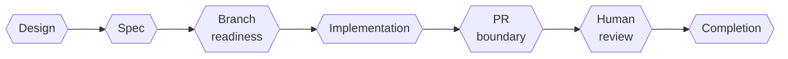

# GateReeve

**Proof at every gate.**

GateReeve is a gate-based, artifact-driven workflow for agent-assisted
software development. It takes an idea from discovery through design,
specification, implementation, review, and closeout — preserving the
reasoning and evidence needed to trust the result. Agents execute with real
autonomy inside clear boundaries; work advances only through gates with
explicit pass conditions.

> **GateReeve runs the gates. You own the judgment.**

Every stage leaves durable records — interview, design, spec with a binary
rubric, plan, decisions, verification evidence, adversarial LLM-as-judge
review, and closeout proof — so the work stays inspectable instead of
disappearing into chat history.

New features are governed by a versioned state-machine protocol packaged in
the plugin. Agents remain free to investigate, design, implement, and
remediate within the current state, but only declared semantic passages can
move the durable workflow forward. Gate results carry input fingerprints, so
changed code or governing artifacts make earlier evidence visibly stale.

The optional Commander.js `gatereeve` CLI observes and operates that same
protocol core. `gatereeve status`, `next`, `history`, and `graph` make the
current feature, active slice, boundary attempt, changes, blockers, and legal
next actions visible; installing the CLI is not required for plugin governance.

## Get started

- **Plugin users:** follow [`INSTALL.md`](INSTALL.md), then the
  [`USER-GUIDE.md`](USER-GUIDE.md) first-feature walkthrough.
- **Plugin developers:** use [`DEVELOPMENT.md`](DEVELOPMENT.md).
- **Release maintainers:** use [`RELEASING.md`](RELEASING.md).
- **Rollout coordinators:** use the
  [behavioral smoke test](docs/PLUGIN-SMOKE-TEST.md).
- **Workflow authors:** change the canonical
  [`WORKFLOW.md`](plugin-src/shared/resources/policy/WORKFLOW.md).
- **[Full overview](https://gatereeve.pages.dev)** — the philosophy, the
  gate spine, workflow layers, artifact flow, and real sample artifacts
  from a completed feature.
- **[INSTALL.md](INSTALL.md)** — install as a native plugin for Claude
  Code, Codex, or both (macOS and Ubuntu).
- **[USER-GUIDE.md](USER-GUIDE.md)** — start your first feature, work the
  gates, deliver sequential PRs.
- **[WORKFLOW.md](plugin-src/shared/resources/policy/WORKFLOW.md)** — the
  canonical process the plugin implements, with the
  [complete flow diagram](plugin-src/shared/resources/policy/WORKFLOW.mermaid).

## Why "GateReeve"?

The name borrows from the historical *reeve*: the local official who
enforced standards and kept order on the community's behalf. A gate-reeve
keeps the gates — each a decision point work must clear before it moves on.
GateReeve is a sibling of [PortReeve](https://github.com/TrentBrown/port-server),
the local port authority for development machines.

## License

MIT
