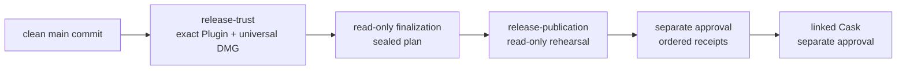

# Releasing the Agentic Development Workflow

This is the maintainer runbook for publishing the native Codex and Claude Code
plugins. It assumes the change has passed the development and PR process in
[`DEVELOPMENT.md`](DEVELOPMENT.md) and has been merged to `main`.

Before preparing a publicly distributable Desktop candidate, complete and
validate [`APPLE-RELEASE-SETUP.md`](APPLE-RELEASE-SETUP.md). The Apple runbook
owns individual enrollment, Developer ID and team API credentials, encrypted
recovery, the protected GitHub environment, and the nonpublishing trust
rehearsal. This document begins only after that prerequisite is ready.

New coordinated Plugin/Desktop RCs use four distinct hosted boundaries:

1. `coordinated-release-prepare.yml` produces Apple-trusted bytes and native
   evidence under `release-trust`, with read-only repository permission.
2. `coordinated-release-finalize.yml` seals those retained exact bytes,
   checksums, update metadata, and publication plan without an environment or
   mutation authority.
3. `coordinated-release-publish.yml` first runs a protected, read-only dry run;
   a later, separately approved dispatch may publish only that sealed plan.
4. Homebrew Cask finalization and publication occur later under their own
   linked record and approval.

Approving `release-trust` or a publication dry run is not approval to publish.
GitHub stores configured credentials between releases; an environment approval
grants a job temporary access and never requires the maintainer to re-enter
credentials or secret values. Do not create release tags manually, invoke the
low-level marketplace script, edit `marketplace`, or run local publication
commands as an alternate production path.

Every job under `release-trust` or `release-publication` must create a GitHub
environment deployment. Never disable deployment creation on these jobs: the
deployment is what applies the configured reviewer gate and preserves the
approval record. If a protected job starts without waiting for review, stop the
release sequence and treat the run as unauthorized boundary evidence.

### 1. Produce the trusted RC packet

Start from a fresh, unused RC identity and the exact current reviewed `main`:

```bash
RC_TAG=v0.1.0-rc.1
gh workflow run coordinated-release-prepare.yml \
  --repo TrentBrown/gatereeve \
  --ref main \
  -f tag="$RC_TAG"
```

Record the successful preparation run ID and its exact `headSha`. The retained
artifacts include the Plugin candidate, submitted and final universal DMGs,
durable Apple attempt history, Apple evidence, exact native ARM64 and Intel
documents, and a schema-v2 lifecycle through `desktop-trust-verified`. Every
artifact is retained for 30 days.

Do not use GitHub's generic **Re-run jobs** once protected trust production has
begun. If polling times out or a run is interrupted, use the bounded recovery
workflow documented in `APPLE-RELEASE-SETUP.md`. Recovery consumes retained
bytes and request history; it never rebuilds, re-signs, or silently resubmits.
If trusted bytes must change, burn the RC identity and begin with a new RC.

### 2. Seal the primary publication packet

Use the original preparation run for the Plugin and the latest successful
preparation/recovery run for trusted Desktop artifacts:

```bash
PREPARATION_RUN_ID=<RUN_ID>
TRUST_ARTIFACT_RUN_ID=<RUN_ID>
SOURCE_COMMIT=<SOURCE_SHA>

gh workflow run coordinated-release-finalize.yml \
  --repo TrentBrown/gatereeve \
  --ref main \
  -f preparation_run_id="$PREPARATION_RUN_ID" \
  -f trust_artifact_run_id="$TRUST_ARTIFACT_RUN_ID" \
  -f tag="$RC_TAG" \
  -f source_commit="$SOURCE_COMMIT"
```

Download the finalization artifact and inspect it locally without mutation:

```bash
FINALIZATION_RUN_ID=<RUN_ID>
PUBLICATION_ROOT="$HOME/Downloads/gatereeve-$RC_TAG-hosted-publication"
gh run download "$FINALIZATION_RUN_ID" \
  --repo TrentBrown/gatereeve \
  --name "gatereeve-$RC_TAG-hosted-publication" \
  --dir "$PUBLICATION_ROOT"
npm start --prefix cli -- plugin release inspect-hosted \
  --release-record "$PUBLICATION_ROOT/release-record.json" \
  --json
```

Record `PLAN_SHA256_FROM_INSPECTION`. Review the source, Plugin tree, final DMG,
native evidence, Apple trust, generated assets, manifest base/output, and exact
surface order. The finalizer is read-only and rejects any input that differs
from the already trusted lifecycle.

### 3. Run the protected nonpublishing rehearsal

Before dispatch, inventory the public tag, release, marketplace head, manifest,
website response, and Cask. Then run the protected dry-run mode:

```bash
PLAN_SHA256_FROM_INSPECTION=<PLAN_DIGEST>
gh workflow run coordinated-release-publish.yml \
  --repo TrentBrown/gatereeve \
  --ref main \
  -f finalization_run_id="$FINALIZATION_RUN_ID" \
  -f tag="$RC_TAG" \
  -f source_commit="$SOURCE_COMMIT" \
  -f plan_sha256="$PLAN_SHA256_FROM_INSPECTION" \
  -f mode=dry-run
```

Approve the `release-publication` environment only after checking the exact
inputs. The dry-run job has read-only permissions, receives no publication
secret, records no publication approval, and cannot mutate a tag, release,
marketplace branch, manifest PR, website, or Cask. Repeat the public inventory
afterward and retain the before/after evidence.

### 4. Publish the separately approved exact primary plan

Public publication requires a new dispatch and a separate decision. Present
the sealed plan and digest for approval, then use the same finalization run and
digest:

```bash
gh workflow run coordinated-release-publish.yml \
  --repo TrentBrown/gatereeve \
  --ref main \
  -f finalization_run_id="$FINALIZATION_RUN_ID" \
  -f tag="$RC_TAG" \
  -f source_commit="$SOURCE_COMMIT" \
  -f plan_sha256="$PLAN_SHA256_FROM_INSPECTION" \
  -f mode=publish \
  -f approved_by="Trent Brown"
```

The hosted publisher creates or verifies the exact tag, publishes the retained
Plugin tree without rebuilding it, creates or verifies the GitHub prerelease
and exact assets, transports update metadata through one deterministic PR, and
waits for the exact Early Access response. It appends a receipt after each
surface. Retry the same dispatch inputs and retained packet after partial
failure; never delete, move, replace, or republish completed history.

### 5. Publish the linked Homebrew Cask later

Primary publication may remain complete while Cask is pending. First install
the exact public DMG directly and launch `GateReeve.app`. Record the confirmer
and timestamp only after both actions succeed. Cask finalization binds that
attestation, the completed primary record digest, primary plan and receipts,
source SHA, trusted DMG, Apple trust, and exact Cask bytes:

```bash
PRIMARY_PUBLICATION_RUN_ID=<RUN_ID>
DIRECT_INSTALL_AT=<ISO_TIMESTAMP>
gh workflow run homebrew-cask-finalize.yml \
  --repo TrentBrown/gatereeve \
  --ref main \
  -f primary_publication_run_id="$PRIMARY_PUBLICATION_RUN_ID" \
  -f tag="$RC_TAG" \
  -f source_commit="$SOURCE_COMMIT" \
  -f direct_install_confirmed_by="Trent Brown" \
  -f direct_install_confirmed_at="$DIRECT_INSTALL_AT"
```

Inspect the resulting packet with `plugin release inspect-cask-hosted`, retain
its separate Cask plan digest, and run the protected dry run:

```bash
CASK_FINALIZATION_RUN_ID=<RUN_ID>
CASK_PLAN_SHA256=<PLAN_DIGEST>
gh workflow run homebrew-cask-publish.yml \
  --repo TrentBrown/gatereeve \
  --ref main \
  -f cask_finalization_run_id="$CASK_FINALIZATION_RUN_ID" \
  -f tag="$RC_TAG" \
  -f source_commit="$SOURCE_COMMIT" \
  -f plan_sha256="$CASK_PLAN_SHA256" \
  -f mode=dry-run
```

After distinct Cask approval, dispatch the same workflow with `mode=publish`
and `approved_by="Trent Brown"`. Only that real job receives the stored
`GATEREEVE_PUBLICATION_TOKEN`; the rehearsal receives no secret. The publisher
transports one exact `Casks/gatereeve.rb` through a deterministic tap PR and
records its URL, merge commit, and file digest. Retry the same packet after
partial failure. Do not substitute a checksum or publish the Cask by hand.

Afterward, verify the user path on a clean Mac:

```bash
brew install --cask TrentBrown/gatereeve/gatereeve
```

This installs Desktop only. Plugin and optional CLI lifecycles remain separate.

## Release Model

A release has one coordinated identity expressed through distinct evidence:

1. a semantic Git tag such as `v0.2.0-rc.1`;
2. the exact source commit referenced by that tag; and
3. checksummed Plugin and universal-DMG candidates built from that source;
4. ARM and Intel Desktop verification plus Apple trust evidence; and
5. a sealed primary plan plus append-only per-surface receipts whose Plugin
   metadata records the deployed tag and source commit; and
6. an optional, separately approved Cask record linked by primary record digest.

Cross-surface publication is ordered rather than falsely described as atomic:
tag, Plugin marketplace, Desktop prerelease, update manifest, then Early Access
website. Every completion is recorded immediately. A retry inspects and
converges the same identity, skipping completed surfaces instead of deleting or
replacing history.

GitHub Actions is the only production publisher for new coordinated releases:



The deployed marketplace remains the successful Plugin baseline. A newer tag
may exist because publication stopped after the tag receipt, so inspection uses
the deployed `RELEASE.json`, the schema-v2 packet, and recorded receipts rather
than assuming the highest tag is complete.

The remaining numbered RC-to-stable instructions describe the retained
Plugin-only schema-v1 compatibility path. They are not an alternate production
interface for a coordinated Plugin/Desktop release, cannot mutate schema-v1
history into schema v2, and must not be used to bypass the hosted boundaries
above.

## Release States and Version Actions

| Intent | Command selector | Version result | Source commit |
|--------|------------------|----------------|---------------|
| Next candidate | `--next-rc` | Increment `rc.N`; from stable, start the next patch at `rc.1` | Current `origin/main` |
| Promote tested candidate | `--promote` | Remove the deployed RC prerelease suffix | Exact deployed RC commit |
| Start bug-fix line | `--bump patch` | Next patch at `rc.1` | Current `origin/main` |
| Start feature line | `--bump minor` | Next minor at `rc.1` | Current `origin/main` |
| Start breaking line | `--bump major` | Next major at `rc.1` | Current `origin/main` |
| Exceptional exact tag | `--tag <TAG>` | The supplied semantic tag | Current `origin/main`, or explicit `--commit` |

Bare `release publish` displays the valid actions and proposed tags in an
interactive terminal. Automation, JSON mode, and `--yes` must provide an
explicit selector; they never inherit the interactive default.

Patch, minor, and major actions always begin with an RC. They do not publish an
untested stable release directly.

## 1. Prepare the Release Checkout

Release from a clean, current `main` checkout. The publisher refuses a dirty
checkout or a normal RC source commit that differs from `HEAD`.

```bash
git switch main
git pull --ff-only origin main
git status --short --branch
npm ci --prefix cli
gh auth status
```

`git status --short --branch` must show no changed or untracked files. Confirm
that the hosted CI matrix for the merged PR and current `main` is green.

Run the broad local acceptance gate when it was not already run against the
exact merged commit:

```bash
bash ci/portable-acceptance.sh
```

## 2. Inspect Current Release State

```bash
npm start --prefix cli -- plugin release list
npm start --prefix cli -- plugin release verify
```

`release list` joins Git tags, Plugin Release workflow runs, and the current
marketplace metadata. Tagless `release verify` checks the currently deployed
release, including both catalogs, both packages, activation hooks, build
provenance, file hashes, and cross-platform shared inventory parity.

Resolve any incomplete current deployment before creating another release.

## 3. Dry-run the Intended Version

For the normal next release candidate:

```bash
npm start --prefix cli -- plugin release publish --next-rc --dry-run \
  --release-record "$RELEASE_RECORD"
```

For a new semantic line, use exactly one of:

```bash
npm start --prefix cli -- plugin release publish --bump patch --dry-run --release-record "$RELEASE_RECORD"
npm start --prefix cli -- plugin release publish --bump minor --dry-run --release-record "$RELEASE_RECORD"
npm start --prefix cli -- plugin release publish --bump major --dry-run --release-record "$RELEASE_RECORD"
```

Review the displayed baseline, version action, proposed tag, selected source
commit, wait/verify policy, and validation result. A dry run performs no tag
mutation.

## 4. Publish a Release Candidate

Use the selector whose dry run was approved. The routine path is:

```bash
npm start --prefix cli -- plugin release publish --next-rc \
  --release-record "$RELEASE_RECORD"
```

The command:

1. fetches `origin/main` and resolves the selected source commit;
2. requires a clean checkout and main ancestry;
3. rejects local or remote tag collisions;
4. validates contracts, portability, native sources, and release requirements;
5. displays the plan and asks for final confirmation;
6. creates and pushes one annotated tag;
7. waits for the tag-triggered Plugin Release workflow; and
8. verifies the complete deployed marketplace tree.

The GitHub workflow reruns portable acceptance, composes both packages from the
tagged commit, creates a fresh marketplace tree, and force-updates the generated
`marketplace` branch only after preparation succeeds.

Record the published tag and source commit:

```bash
RC_TAG=v0.1.0-rc.2
git rev-list -n 1 "$RC_TAG"
npm start --prefix cli -- plugin release verify --tag "$RC_TAG"
```

Replace the example `RC_TAG` with the tag the publisher actually created.

### Create an offline delivery bundle when needed

After remote verification passes, package the exact deployed marketplace for
recipients who should not need access to this repository:

```bash
npm start --prefix cli -- plugin release bundle \
  --tag "$RC_TAG" \
  --output-dir "$HOME/Downloads"
```

The command verifies the deployment again, fetches the exact marketplace
commit, and produces a versioned ZIP plus `.sha256` sidecar. The ZIP includes
both native packages, both catalogs, release provenance, and the canonical
`INSTALL.md` and `USER-GUIDE.md` at the archive root. It does not publish, tag,
or mutate the marketplace.

Omit `--tag` to bundle the currently deployed release. Existing artifacts are
preserved unless `--force` is supplied.

## 5. Run Release-Candidate Acceptance on Ubuntu

Stable promotion requires evidence that the deployed RC passed on Ubuntu in
both Codex and Claude Code.

On a supported Ubuntu 22.04 or 24.04 system:

1. upgrade each native marketplace and installed plugin using
   [`INSTALL.md`](INSTALL.md#9-upgrade);
2. run `workflow-doctor` in a fresh session for each platform;
3. run the complete
   [`Behavioral Plugin Smoke Test`](docs/PLUGIN-SMOKE-TEST.md) separately in
   Codex and Claude Code;
4. preserve each session transcript and resulting fixture artifacts; and
5. confirm that the installed package version and marketplace source match the
   RC under test.

The smoke test must prove implicit workflow activation, the design interview,
branch artifact creation, and the design gate. Merely seeing the plugin in a
native manager list is not release evidence.

## 6. Commit the Stable Evidence

Stable evidence is produced after the RC commit and therefore cannot be added
to that immutable commit. Store the evidence on `main` before promotion. The
stable tag will still point to the exact RC source commit.

Use `docs/releases/ubuntu-rc.json` for the current promotable RC. Store the
referenced transcripts in durable repository paths or another durable evidence
store available to reviewers. The JSON contract is:

```json
{
  "schemaVersion": 1,
  "status": "passed",
  "releaseCandidate": "v0.1.0-rc.2",
  "candidateSourceCommit": "0123456789abcdef0123456789abcdef01234567",
  "ubuntu": {
    "passed": true,
    "version": "24.04"
  },
  "platforms": {
    "codex": {
      "passed": true,
      "transcript": "docs/releases/evidence/v0.1.0-rc.2/codex.md"
    },
    "claude": {
      "passed": true,
      "transcript": "docs/releases/evidence/v0.1.0-rc.2/claude.md"
    }
  }
}
```

Use the full commit returned by `git rev-list -n 1 "$RC_TAG"` as
`candidateSourceCommit`. The evidence must identify the deployed RC's base
version and exact source commit. A stable dry run rejects a mismatch.

Commit the evidence through the normal topic-branch and PR workflow. Wait for
that evidence PR to merge, then update the release checkout to the new clean
`main` before continuing.

## 7. Dry-run Stable Promotion

Confirm the marketplace still deploys the candidate whose evidence was merged:

```bash
git switch main
git pull --ff-only origin main
npm start --prefix cli -- plugin release list
npm start --prefix cli -- plugin release verify
npm start --prefix cli -- plugin release publish --promote --dry-run \
  --release-record "$RELEASE_RECORD"
```

Promotion differs deliberately from an RC publication:

- the stable tag is computed from the deployed RC;
- the selected source is the deployed RC's historical commit, not current
  `main`;
- source validation runs in an isolated temporary Git worktree at that commit;
- `docs/releases/ubuntu-rc.json` is read from the current clean checkout; and
- its `candidateSourceCommit` must equal the commit receiving the stable tag.

Review the proposed stable tag and source commit before proceeding.

## 8. Promote the Exact RC

```bash
npm start --prefix cli -- plugin release publish --promote \
  --release-record "$RELEASE_RECORD"
```

The local publisher validates the historical source plus current evidence and
pushes a stable tag at the RC commit. Stable GitHub Actions checks out and tests
that exact tag, then reads the post-RC evidence file from `origin/main`. The
evidence binding prevents newer main code from entering the stable package.

Do not use `--tag` at current `main` as a substitute for `--promote`; that would
create a stable release from code that was not the tested RC.

## 9. Verify and Announce the Deployment

The guarded publisher waits and verifies by default. Repeat the checks
explicitly when diagnosing or recording evidence:

```bash
npm start --prefix cli -- plugin release list --limit 10
npm start --prefix cli -- plugin release verify
```

Then upgrade Codex and Claude Code through their native managers, start fresh
sessions, and run `workflow-doctor` again. For a coordinated rollout, repeat
the behavioral smoke test and retain its transcript.

Record at least:

- release tag and source commit;
- Plugin Release workflow URL and conclusion;
- deployed marketplace commit;
- marketplace verification verdict;
- Ubuntu version and Codex/Claude evidence paths; and
- any post-release doctor or behavioral-smoke results.

## Asynchronous Publication

Waiting and verification are the safe defaults. If a deliberate operational
need requires returning immediately after the tag push, both safeguards must be
disabled explicitly:

```bash
npm start --prefix cli -- plugin release publish \
  --next-rc \
  --release-record "$RELEASE_RECORD" \
  --no-wait \
  --no-verify
```

Take responsibility for completing the two deferred steps:

```bash
RC_TAG=v0.1.0-rc.2
npm start --prefix cli -- plugin release watch --tag "$RC_TAG"
npm start --prefix cli -- plugin release verify --tag "$RC_TAG"
```

Automation may add `--yes --json`, but it must also supply `--tag`,
`--next-rc`, `--promote`, or `--bump`. Tagless automation is rejected.

## Failure Diagnosis and Recovery

### The checkout differs from the selected commit

Ordinary RC and bump releases require local `HEAD` to equal the selected
`origin/main` commit. Return to a clean, updated `main` checkout. Do not bypass
the check with `--commit` for a routine release.

Promotion is the only computed operation designed to select a historical
commit; it validates that source in a temporary worktree.

### The checkout is dirty

Stop. Commit the intended work through a reviewed PR, or preserve unrelated
local work outside the release checkout. Do not stash-and-release without first
confirming that `HEAD` is the exact reviewed commit.

### The tag already exists

Release tags are immutable publication attempts. Do not move, delete, or reuse
the tag to make a failed run look successful. Fix the cause on `main` and
publish the next RC or another intentional semantic version.

### The tag push fails

If the remote push fails, the publisher removes the just-created local tag. No
marketplace deployment has started. Correct authentication or remote access,
recheck release state, and repeat the dry run.

### GitHub Actions fails after the tag exists

The failed tag remains as audit history. The publication script constructs a
fresh tree and updates `marketplace` only at the final push, so a preparation
failure preserves the previous complete marketplace release.

Inspect the selected run:

```bash
npm start --prefix cli -- plugin release list --limit 10
gh run list --workflow plugin-release.yml --limit 10
gh run view <RUN_ID> --log-failed
```

Fix the defect through a new PR and publish a new RC. Do not reroute the failed
tag to another commit.

### Marketplace verification is incomplete

Run explicit verification for the intended tag and inspect every failed check:

```bash
RELEASE_TAG=v0.1.0-rc.2
npm start --prefix cli -- plugin release verify --tag "$RELEASE_TAG" --json
```

Common causes include a workflow failure, mismatched `RELEASE.json`, manifest
version drift, missing hooks, incorrect build provenance, file hash drift, or
different shared inventories between platforms.

### Stable evidence is rejected

Confirm all of the following:

- `status` is `passed`;
- `releaseCandidate` is a semantic `rc.N` tag with the stable base version;
- `candidateSourceCommit` is the exact full commit of the deployed RC;
- the Ubuntu version is present and `passed` is true; and
- both Codex and Claude entries are passed with nonempty transcript references.

Do not edit evidence merely to satisfy validation. Correct or repeat the
underlying acceptance work.

### A published version must be rolled back for users

Stop further rollout and use the known-good marketplace commit procedure in
[`INSTALL.md`](INSTALL.md#10-roll-back-an-upgrade) for affected installations.
The repository does not currently expose a guarded command for force-reverting
the production marketplace branch. Do not improvise one during an incident;
preserve evidence, diagnose the release, and choose an explicit corrective
release or maintainer-approved recovery plan.

## Low-level Release Mechanics

These surfaces support CI and tests. They are not the routine human release
interface.

### `plugin release prepare`

The tag-triggered workflow calls this command with an explicit tag, tagged
source commit, and fresh output directory. It composes both packages, creates
the complete marketplace layout, and writes `RELEASE.json` without publishing.

For stable tags, CI reads `docs/releases/ubuntu-rc.json` from `origin/main` and
passes it to `prepare`. Source code, dependencies, tests, and package contents
still come from the exact tag checkout.

### `ci/publish-marketplace.sh`

This script copies an already complete release tree into a temporary Git
repository, commits it, and force-updates `HEAD:marketplace`. GitHub Actions
supplies its authenticated remote. Running it manually against the production
repository bypasses the guarded publisher, so do not use it as a shortcut.

### The Plugin Release workflow

`.github/workflows/plugin-release.yml` triggers only on `v*` tag pushes. It
requires the tagged commit to be an ancestor of `origin/main`, installs the
pinned Node baseline, runs portable acceptance, prepares one complete release
tree, and publishes that tree atomically.

## Release Checklist

- [ ] Intended changes are merged to `main` and hosted CI is green.
- [ ] Release checkout is clean and exactly current with `origin/main`.
- [ ] Current deployed marketplace verifies completely.
- [ ] Intended version action passes a dry run.
- [ ] RC publication workflow and marketplace verification pass.
- [ ] RC is installed and tested on supported Ubuntu in Codex and Claude Code.
- [ ] Doctor and behavioral smoke evidence is preserved for both platforms.
- [ ] `docs/releases/ubuntu-rc.json` names the exact deployed RC commit.
- [ ] Evidence is merged to `main` before stable promotion.
- [ ] Stable promotion dry run selects the tested RC source commit.
- [ ] Stable publication workflow and marketplace verification pass.
- [ ] Native-manager upgrades and post-release doctor checks pass.
