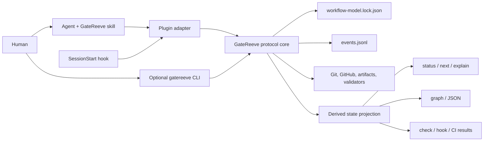
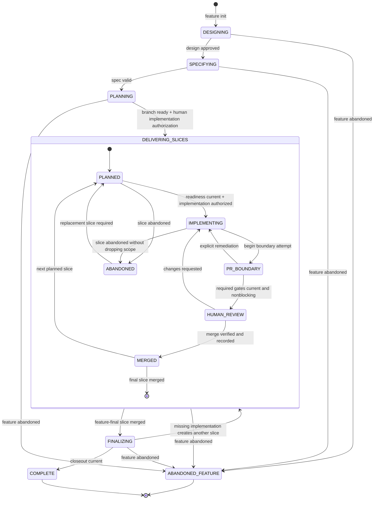
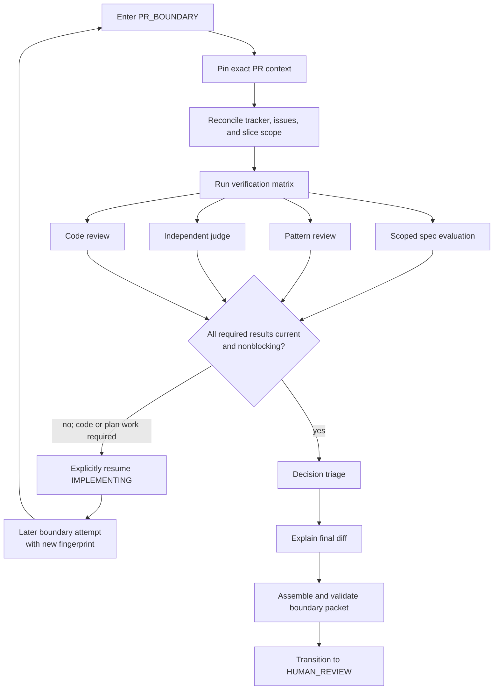
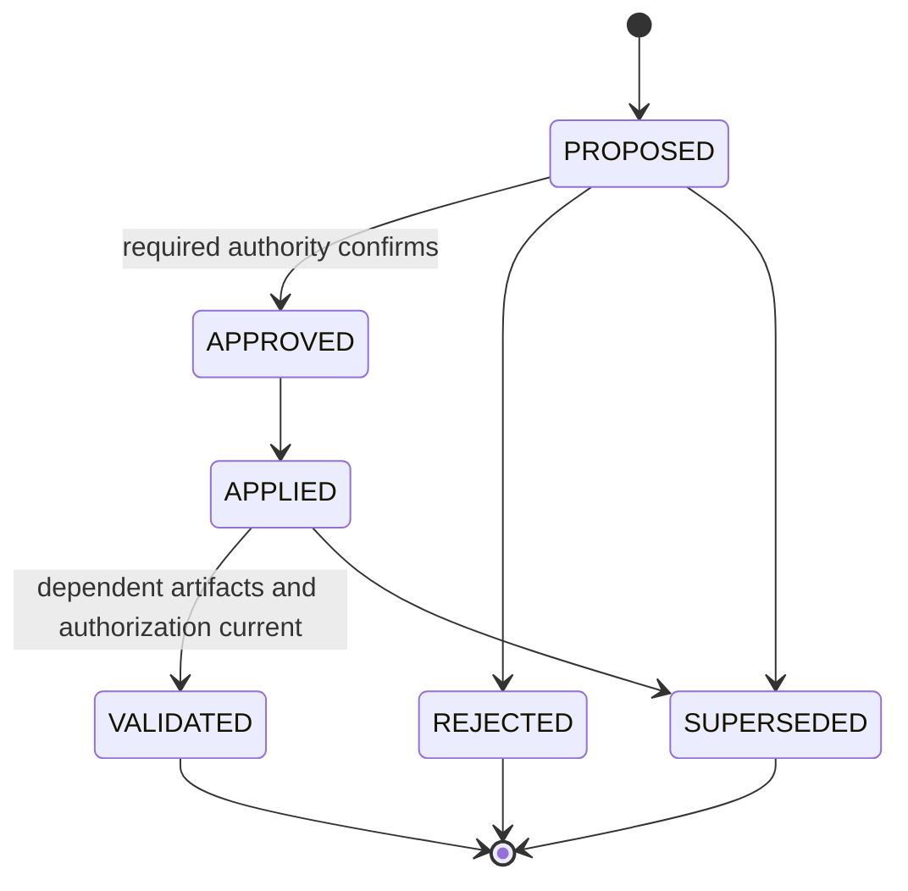

# Design - workflow-state-machine-cli

**Status:** approved 2026-08-25

## Problem

GateReeve defines a strong gate-based workflow in policy, skills, artifacts,
and deterministic helper scripts, but it does not have one authoritative model
of current workflow state or legal passage. Agents coordinate the process from
instructions and context. They usually do this well, but the system cannot
mechanically prevent a gate from being skipped, accepted out of order, or
credited with evidence that belongs to an earlier PR head, specification, or
workflow model.

The same gap reduces observability. After interruption, a human or fresh agent
must reconstruct the active phase, delivery slice, boundary attempt, stale
evidence, unresolved changes, and next legal actions from several documents and
external systems. Existing diagrams explain the workflow model but cannot show
where a particular feature currently is.

An external DAG runner would add scheduling and persistence machinery without
solving the adaptive nature of implementation. GateReeve instead needs a small
deterministic protocol layer that governs passage while leaving agents free to
perform the work inside each state.

## Intent

Build a hierarchical state machine and shared protocol core that make
GateReeve the authoritative reeve of its own gates. The system should:

- Reject missing, out-of-order, inconsistent, or stale gate passage.
- Infer current repository and external facts, record meaningful decisions and
  passages, and revalidate freshness before every mutation.
- Give humans and fresh agents an immediate, accurate view of feature, slice,
  gate, change, evidence, and suspension state.
- Preserve sequential PR slices as first-class instances with durable boundary
  histories.
- Allow agents to operate autonomously until the next genuinely human decision.
- Generate state-machine and current-position diagrams from the same model used
  for enforcement.
- Remain a protocol enforcer and observer, not an agent scheduler, workflow
  engine, or security boundary against a malicious full-access process.

V1 succeeds primarily when illegal or stale passage is mechanically rejected.
Fast state reconstruction is secondary. Long autonomy is a constraint: the
protocol must not add human interruptions beyond genuine approval, amendment,
risk, review, and abandonment decisions.

## Chosen shape

### Shared protocol core with two adapters

The authoritative component is a JavaScript protocol core packaged with the
GateReeve plugin. State-affecting agent skills and the optional Commander CLI
use the same implementation.

The core owns model validation, projection, guard evaluation, invalidation,
evidence freshness, semantic transitions, and journal writes. It never chooses
skills, launches agents, schedules work, runs retries, or commits changes.

Every state-affecting skill follows one contract:

1. Ask the core whether the operation is eligible and obtain authoritative
   context, guards, blockers, and output locations.
2. Let the agent perform the activity with normal autonomy.
3. Submit evidence or a semantic transition request.
4. Let the core freshly revalidate and record or reject the request.

### Recorded, inferred, and derived state

GateReeve follows the rule: **infer facts, record decisions and passages, and
always revalidate freshness**.

- A tracked `events.jsonl` records meaningful transitions, human
  confirmations, gate results, waivers, invalidations, pause/resume events, and
  discovered-change events. Read-only observations do not create events.
- Git state, branches, SHAs, PR facts, file existence, artifact hashes, and
  validator results are inferred from their authoritative sources.
- Feature position, slice position, gate eligibility, freshness, blockers, and
  next actions are projections derived from the journal plus current facts.
- There is no second authoritative mutable `state.json`.
- Events have stable IDs, monotonically increasing sequence numbers, schema
  validation, and atomic append behavior. Corrections use later events. The
  journal is not hash-chained; Git provides ordinary history, while hashes are
  reserved for model identity and evidence freshness.
- The core never stages or commits the journal. Status exposes uncommitted
  journal changes and clean-tree prerequisites.

### Pinned declarative model and trusted guards

The topology is GateReeve-specific declarative data rather than imperative CLI
branching or a generic workflow DSL. It declares states, transitions, nested
gates, guard identifiers, authority requirements, invalidation dependencies,
and presentation metadata. A closed JavaScript registry implements trusted
guard predicates; model files cannot embed arbitrary commands or code.

`gatereeve feature init` atomically creates the feature record and enters
`DESIGNING`. It writes a tracked `workflow-model.lock.json` containing the
normalized model, schema/model identity, content hash, guard identifiers, and
protocol-core compatibility range. Active features do not silently inherit a
new model after plugin upgrades. Model migration is an explicit,
human-confirmed passage with an impact report.

### Hierarchical feature and slice state

Feature lifecycle states describe where feature-level work occurs. Gates are
conditions on transitions rather than extra feature states. Dynamic delivery
slices are instances of one fixed child lifecycle.

`DELIVERING_SLICES` is the internal composite. Human-facing output emphasizes
the established GateReeve slice phase—`IMPLEMENTING`, `PR_BOUNDARY`, or
`HUMAN_REVIEW`—and also shows the containing feature lifecycle.

A feature may contain any number of `PROPOSED` or `PLANNED` slice instances,
but only one may be active. A later slice cannot start until the current slice
is `MERGED` or `ABANDONED`. Slice names, branches, PRs, scope, plan/rubric
mappings, and attempts are instance data, never new state types.

Pause is a recorded suspension overlay rather than a lifecycle state. It
preserves the exact feature, slice, gate, and change positions while blocking
ordinary mutations until resume.

### Multidimensional gate state

PR-boundary activities are first-class child gates inside the composite
`PR_BOUNDARY` state. A gate does not use one overloaded status enum. It has:

- Recorded outcome: `UNSET`, `PASS`, `FAIL`, `WAIVED`, or `NOT_APPLICABLE`.
- Evidence reference, input fingerprint, and recording event.
- Derived freshness: `CURRENT`, `STALE`, or `UNKNOWN`.
- Derived eligibility and explicit blocking reasons.
- Optional observational execution activity that carries no transition
  authority.

This permits an honest projection such as “previous outcome PASS, now STALE,
rerun ELIGIBLE.” Waivers are permitted only where declared by the pinned model,
require explicit human risk acceptance, and apply to one gate instance and
fingerprint. `NOT_APPLICABLE` is not a waiver. GateReeve exposes no generic
force bypass.

### PR-boundary partial order and attempts

The PR boundary is a dependency graph, not a serial execution script. The core
makes work eligible; the agent decides whether eligible reviews run serially or
concurrently.

A failed gate blocks the current attempt in place. Rerun, an allowed waiver,
or an explicit remediation transition are the available responses. Source
mutation while the recorded state remains `PR_BOUNDARY` is an observable
inconsistency: evidence becomes stale, but lifecycle state is never silently
repaired. Earlier attempts and reports remain historical evidence.

The final real slice may enter a boundary with `FEATURE_FINAL` scope.
Complete-feature verification, spec evaluation, rubric completion, and judge
run alongside final-slice-focused pattern review, code review, and explain
diff. After that PR passes human review and merges, the feature enters
`FINALIZING` only for merge confirmation, retention, completion record,
external closeout when applicable, feature-record freeze, and final checkpoint.

### First-class discovered changes

Discoveries during delivery do not send the feature backward through its
historical design/specification/planning phases. They create a visible,
blocking child record with a fixed lifecycle:

The record identifies its origin, target (`design`, `spec`, `plan`, or slice
structure), rationale, impact, blocker, and invalidation set. Design and
specification amendments require human confirmation and stale the previous
implementation authorization. After downstream reconciliation and readiness
checks, another human confirmation authorizes resumed code-changing work.
In-scope plan and slice changes may be approved and revalidated by agents
without another human interruption.

### Sparse human decisions and long autonomy

GateReeve is process governance for cooperative agents, not identity security.
It does not attempt to prove whether a human or agent operated the local
process. Human confirmation may be given in conversation and recorded by an
agent, or recorded directly through the optional CLI.

Human confirmation is required only for:

- Initial design approval.
- Initial authorization of the approved feature plan.
- Design or specification amendments and renewed implementation authority.
- Waivers or acceptance of known risk.
- Human review acceptance.
- Complete-feature abandonment.

One implementation authorization covers the approved feature plan and all its
sequential slices. Agents may otherwise plan within scope, implement, enter and
execute boundaries, remediate findings, adjust in-scope plans/slices, record
evidence, and finalize autonomously. Normal autonomous execution stops only at
human review, a higher-level amendment, or a waiver/risk decision.

### Observer and command surfaces

The public `gatereeve` program evolves the existing Commander/`qp-cli-core`
maintainer CLI into one namespaced executable. Workflow commands are public;
plugin composition and release commands remain under maintainer namespaces.
Exact grammar is settled in the specification, but the intended families are:

| Family | Purpose |
|---|---|
| `status` | Render feature, active slice, gates, changes, freshness, blockers, and next actions |
| `next` | Return eligible semantic commands and why other transitions are blocked |
| `explain` | Explain a gate, transition, invalidation, or recorded decision |
| `history` | Read the event journal as human or structured history |
| `graph` | Generate complete-model or current-feature Mermaid/JSON views |
| `check` | Assert a requested invariant for skills, hooks, or CI |
| `feature` | Initialize, pause, resume, abandon, migrate model, and finalize |
| `slice` | Propose, plan, start, enter boundary, remediate, merge, or abandon a slice |
| `gate` | Record evidence/outcome, rerun, mark not applicable, or request a permitted waiver |
| `change` | Propose, approve, reject, apply, validate, or supersede a discovered change |
| `plugin` / `release` | Preserve existing maintainer composition, validation, and publication operations |

There is no public generic `advance` or `--force`. Semantic commands state the
decision being made. Read-only queries exit successfully whenever they can
produce a projection, even if that projection is blocked or stale. `check`
returns nonzero for a failed assertion. Rejected mutations append nothing and
return nonzero. All commands expose one stable JSON result envelope from which
human output is rendered.

`gatereeve graph --model` shows the complete topology.
`gatereeve graph` overlays the current feature position, active slice, passed
and eligible transitions, stale gates, blockers, and change effects. V1 emits
Mermaid and JSON; HTML/SVG or open-in-browser behavior may be added later.

### Packaging, hooks, and rollout

Node becomes a documented GateReeve prerequisite. The plugin packages a
plugin-local JavaScript protocol core and adapter, so state governance does not
depend on installing a global CLI. Installing the PATH-accessible Commander CLI
is optional and provides the same behavior through the same core. Existing
Python validators may remain trusted subprocess guard providers until
deliberately migrated; there is never a second Python state authority.

The existing `SessionStart` hook gains optional feature discovery and concise
current-state context. V1 does not install Git hooks or alter
`core.hooksPath`. Hooks and CI may call read-only or assertion surfaces but may
never record passage.

Existing in-flight feature records without a model lock and journal may finish
under an explicit legacy mode. New features use governance by default. V1 does
not attempt to adopt or reconstruct history for an in-flight legacy feature.

## Alternatives considered

- **External DAG orchestration:** Rejected as a GateReeve dependency. It
  duplicates sequencing, complicates adaptive implementation, and does not make
  probabilistic node results deterministic.
- **Agent-only policy and stronger skills:** Retained for activity guidance but
  insufficient as the sole passage authority because it cannot mechanically
  reject stale or illegal advancement.
- **One flat state enum:** Rejected because feature position, slice position,
  gate outcome, freshness, blocking, changes, and suspension are independent
  dimensions.
- **PR-boundary checks as top-level feature states:** Rejected. They are
  first-class nested gates inside the active slice boundary and may have
  simultaneous eligibility and results.
- **A generic workflow DSL:** Rejected. Declarative data is constrained to the
  GateReeve model and references only trusted guards.
- **Required global CLI:** Rejected. Governance belongs in the plugin; the CLI
  is an optional adapter.
- **Separate public and maintainer CLIs:** Rejected in favor of one Commander
  executable with explicit namespaces.
- **Python public CLI or parallel Python state core:** Rejected in favor of the
  established Commander.js pattern and one JavaScript authority. Python
  validators may remain leaf guard providers.
- **Two-step human request/grant protocol:** Rejected as high-friction ceremony
  that provides no meaningful security against a full-access agent. Sparse
  human confirmation gates preserve autonomy.
- **Hash-chained event journal:** Rejected because it neither improves ordinary
  agent decisions nor prevents deliberate rewriting by a full-access process.
  Git, schemas, sequences, and atomic writes are sufficient for v1.
- **Automatic Git-hook installation:** Rejected until observed failures justify
  invasive repository integration.
- **Mid-feature adoption:** Deferred. Existing features finish in legacy mode;
  governed features begin at initialization.
- **Concurrent active slices:** Rejected for v1. Sequential delivery remains an
  enforceable invariant.

## Constraints

- The authoritative repository is GateReeve; the work occurs on
  `workflow-state-machine-cli` in its isolated peer worktree.
- The feature has no external task or issue-number requirement.
- The protocol core is deterministic but consumes probabilistic evaluation
  evidence; it validates scope, freshness, disposition, and passage rather than
  pretending to reproduce semantic judgment.
- Node is a plugin prerequisite. The CLI uses Commander.js and `qp-cli-core`.
- Existing Git, GitHub, feature-context, boundary-packet, and Python validator
  contracts must be reused or deliberately migrated rather than reimplemented
  inconsistently.
- The event journal and model lock are tracked artifacts and can make the
  worktree dirty. The protocol never stages or commits on the user's behalf.
- Model and evidence fingerprints are correctness mechanisms; GateReeve does
  not claim cryptographic actor identity or protection against malicious
  full-access agents.
- Only one delivery slice may be active at a time.
- The plugin and optional CLI must behave consistently on every supported
  GateReeve platform and agent harness.
- The protocol core cannot become an agent scheduler, retry engine, queue, or
  arbitrary user-programmable state-machine framework.

## Open risks

- Exact gate guards and the invalidation dependency matrix may expose hidden
  coupling in current policy, especially around evidence-only commits, remote
  PR-head movement, specification amendments, and feature-final scope.
- A tracked event journal changes during boundary work. Packet finalization and
  clean-tree rules must classify its paths without permitting undeclared source
  changes.
- A model lock snapshots topology but not executable guard code. Compatibility
  and model migration need precise guarantees so a newer core does not subtly
  reinterpret an older guard identifier.
- Human confirmation through conversation is a cooperative-process attestation,
  not authenticated identity. The UI must be honest about that boundary.
- Classifying whether a plan/slice change remains within approved design/spec
  can require agent judgment. Deterministic guards can enforce recorded impact
  and required consequences but cannot eliminate semantic classification.
- GitHub merge modes can change commit identity between reviewed PR head and
  merged integration state. Finalization must prove the reviewed content was
  merged without assuming SHA equality.
- Node and optional CLI distribution add installation, doctor, upgrade, and
  cross-platform compatibility work to a plugin that previously did not require
  Node.
- A rich hierarchical graph can become visually noisy. The default graph and
  status views need progressive disclosure so first-class nested state remains
  visible without overwhelming the operator.
- Legacy and governed features temporarily coexist. Discovery and skills must
  report the selected mode plainly and never silently downgrade a governed
  feature.

## Changes
